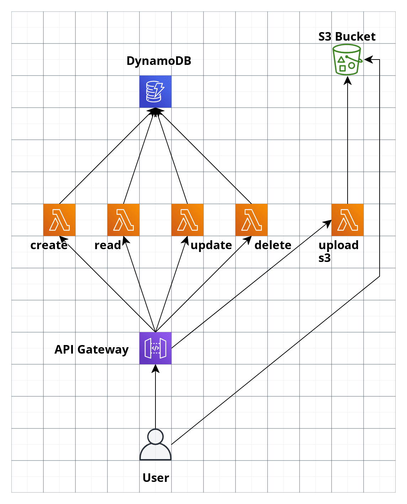

# SERVERLESS FRAMEWORK COURSE

Our course project

### Bienvenida

1. Introduccion
1.1 propuesta: presentar el proyecto al iniciar el curso

### Conceptos claves
2. Terminologia: servidor, cliente, serverless, cloud, cloud provider, serverless framework
2b. pros and cons of serverless technologies
3. instalacion de herramientas (node, npm, python, serverless, aws cli) explicacion breve de que hace cada una y porque se instala

### Ecosistema Serverless en AWS
4. explicar que es el freetier, creacion de cuenta en aws, crear usuario admin, crear api keys, hacer aclaraciones de seguridad, hacer conexiones a otros cursos para aprender mas sobre aws
5. uso basico de serverless framework para crear primer aplicacion hola mundo, se muestra el api,se muestra el serverless cli
6. explicacion de que se creo en el punto anterior en amazon, mostrar como serverless framework facilita/abstrae las cosas
6b. lets run a local env using sls local invoke and sls offline
7. clase teorica de todos los servicios serverless que podemos usar en aws, dejar claro que serverless no es solo lambda

### Desarrollando nuestra aplicacion Serverless
8. se muestra la app que vamos a crear en el curso, un crud serverless, apigateway lambda dynamodb, con un endpoint para firmar urls y subir a s3
9. se inicia creacion de app, con el get
10. explicacion basica de dynamodb, creamos tabla e insertamos algunos datos manualmente
10b. get con dynamodb local plugin, para tener un ambiente local con un dynamodb local
11. desplegamos/adaptamos la app a dynamodb remoto y traemos los datos con el get
11b. organizamos el proyecto, vamos a reducir su tamaño desplegando unicamente lo que necesitamos y nos preparamos para crear el create del crud
12. creamos post para insertar datos
12b. re ajustamos nuestra funcion get para obtener usuario enviando el id en el path, mostramos el potencial de api gateway validando logica de negocio
13. DELETE con python :nice:
14. UPDATE
15. explicacion basica de s3 y como lo usaremoss para almacenar imagenes firmando urls
15b. crear bucket usando sintaxis de cloudformation, organizar lambda con permisos, signaure y validaciones, probar desde local # todo ver si esta clase es muy gorda para partirla en dos

## asegurando la app

16. seguimos hablando de seguridad, nuestro endpoint para subir imagenes firmado funciona pero cualquiera puede subir pedir una url firmada, hablamos de dos formas serverless de asegurar nuestros endpoints (api key, custom authorizer)
16b.api-key
16c. custom-authorizer

### Bonus

17. bonus: otros servicios serverless, casos de uso donde los podriamos usar sns, sqs

18. crear recursos que no se pueden desde serverless usando sintaxis de cloudformation
19. Flujo de CI/CD con Github Actions
### Cierre de curso

20. Trabajo futuro y mejoras dependiendo de nuestros casos de uso
21. Conclusiones y cierre de curso