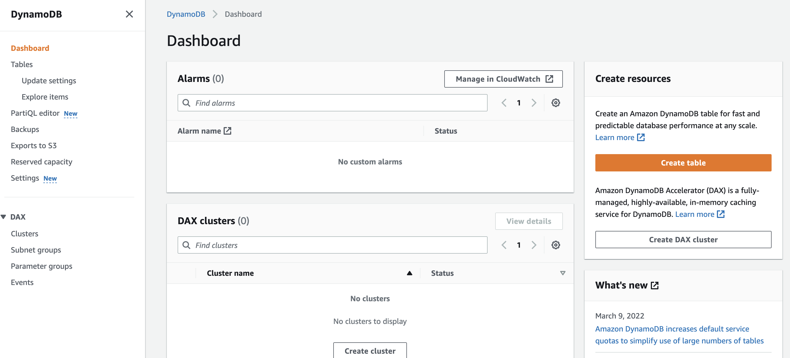
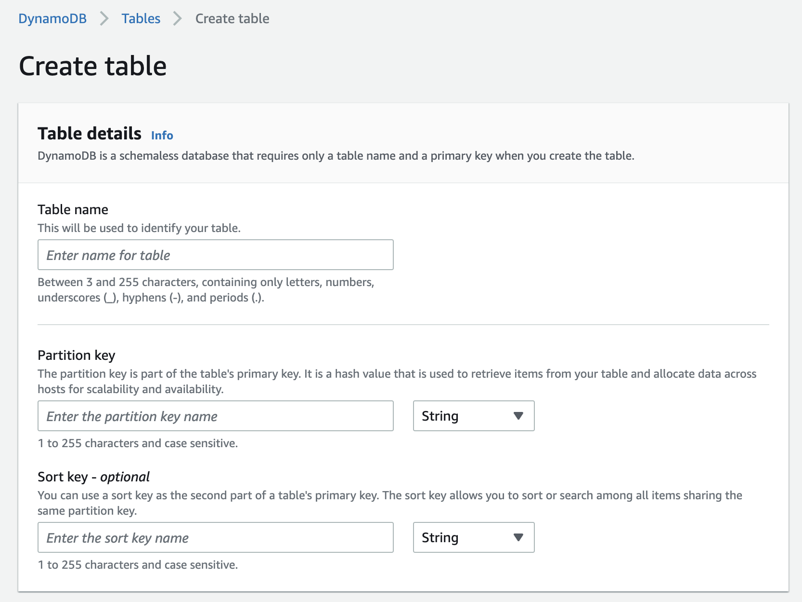
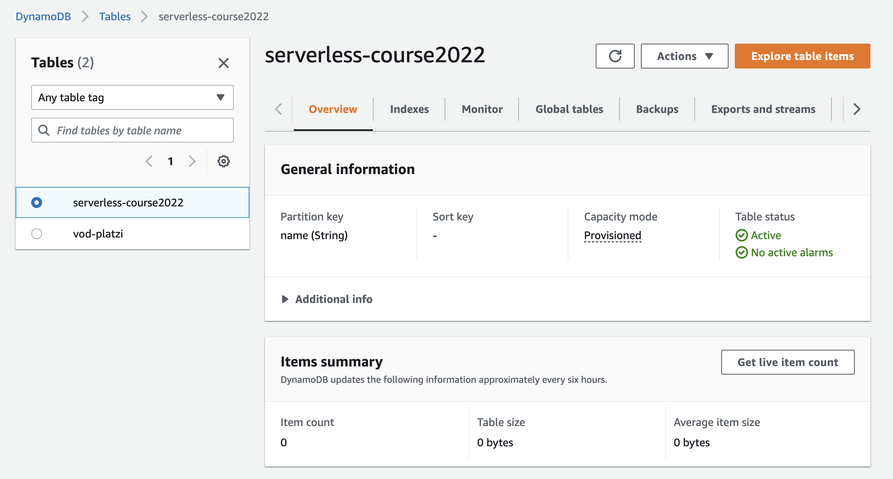

## preconditions
nvm use lts/gallium
conda create -n python3.8 python=3.8
conda activate python3.8
aws configure (to setup credentials)

Project step by step:

1. serverless create --template aws-nodejs --path serverless-crud-dynamodb

2. cd serverless-crud-dynamodb

We will notice that 3 files are created, gitignore, handler.js y serverless.yml

3. Lets create our first dynamoDB table, we can create it in multiple ways, using CDK, using cloudformation files, terraform, pulumi, etc.
Let us show you the two easiest ways according to the project we are working on.

- In AWS, go to DynamoDB section

- Press the Create Table Button

Lets make a quick recap about these DynamoDB features
https://platzi.com/clases/1426-db-aws/15228-caracteristicas-de-dynamodb/

- Fill the form with the name, partition and sort key

| Field      | Value                 |
| ---------- | --------------------- |
| Table name | serverless-course2022 |
| partition  | name                  |

Other values will be setted by default, then we can create the table
