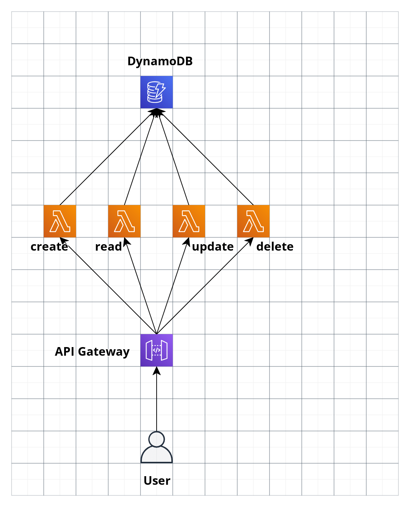

# SERVERLESS FRAMEWORK COURSE 1

## Bienvenida

### 1. Bienvenida al curso de Serverless Framework

Explicar el alcance y proyeccion del curso y de los profesores (Mencionar que el curso es doble, para mejor provecho hacer los dos y antes haber hecho el curso conceptual de serverless del otro man)

### 2. Presentacion de proyecto

Presentar el proyecto a construir y las integraciones a implementar (mencionar que este proyecto se continuara en el segundo curso)

## Conceptos Claves

### 3. Definiciones conceptos del ecosistema serverless

Explicar terminologia: Terminologia: servidor, cliente, serverless, cloud, cloud provider, serverless framework

### 4. Pros y Cons de las tecnologias serverless

Detallar ventajas y desventajas de usar tecnologias serverless (hablar de como serverless framework reduce algunas de las desventajas de las tecnologias serverless)

### 5. Herramientas necesarias para un ambiente de trabajo con serverless framework

Instalar (Node, NPM, python, serverless framework, aws cli, java JRE. Explicacion breve de que hace cada una y porque se instalan

## Ecosistema Serverless en AWS

### 6. Configuracion necesaria para inciar nuestro proyecto

Acceder a la consola web, crear api key access key, hacer aclaraciones de seguridad, configurar AWSCLI

### 7. Iniciamos nuestro proyecto con serverless framework

Uso basico de serverless framework para crear primer aplicacion hola mundo, se muestra el api,se muestra el serverless CLI

### 8. Revision de los recursos creados

Recorrer la consola de AWS para detallar los recursos creados por sls framework, mostrar como sls framework abstrae y nos ahorra trabajo

### 9. Desarrollo local con serverless framework

Ejecutar nuestra aplicacion serverless en local, instalar y probar sls offline