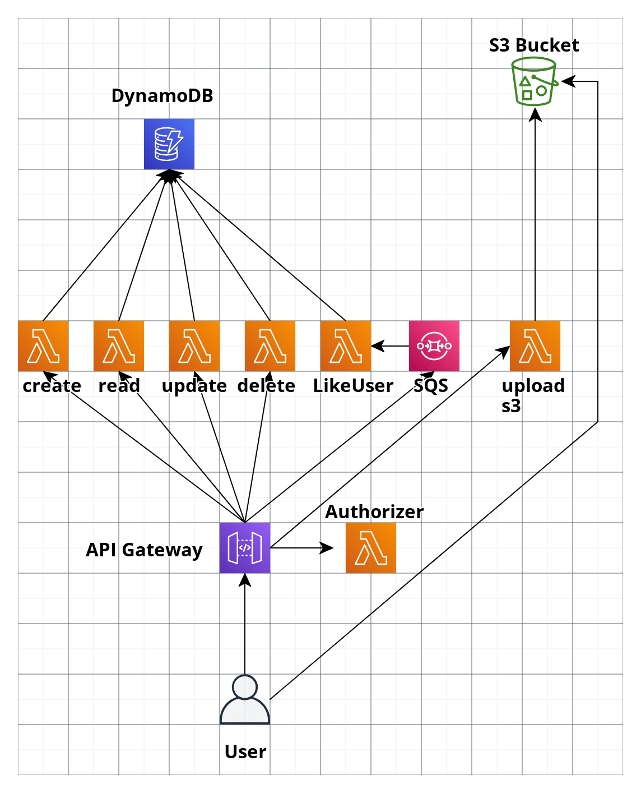

# SERVERLESS FRAMEWORK COURSE 2

## Bienvenida

### 1. Bienvenida al curso de Serverless Framework - avanzado

Explicar el alcance y proyeccion del curso y de los profesores (Mencionar que el curso es doble, para mejor provecho hacer los dos y antes haber hecho el curso conceptual de serverless del otro man)

### 2. Desplegamos nuestro proyecto

Desplegamos el proyecto del curso anterior y repasamos lo que se hizo en el curso anterior

### 3. Presentacion del proyecto

Presentar el proyecto a construir y las integraciones a implementar

